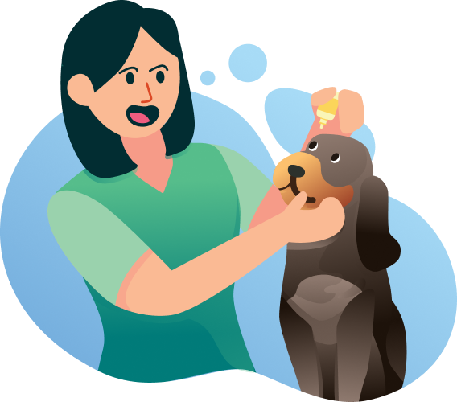

<h1>We Care – About Your Pet</h1>

<em>Uma landing page responsiva que coloca o cuidado com seu pet em primeiro lugar, unindo design limpo e navegação intuitiva.</em>

<h2>Descrição</h2>
<ul>
  <li>Menu de navegação simples no header</li>
  <li>Ilustração vetorial estilizada ao lado do conteúdo</li>
  <li>Tipografia forte e hierarquia clara para títulos e texto</li>
  <li>Botões de ação (LOGIN e EXPLORE) com alto contraste</li>
</ul>

<h2>Tecnologias</h2>
<ul>
  <li><strong>HTML5</strong></li>
  <li><strong>CSS3</strong></li>
  <li>Fonte: Montserrat via Google Fonts</li>
</ul>

<h2>Estrutura do projeto</h2>
<pre>
ProjetoWeCare/
│
├── img/
│   └── Illustration.png       # Ilustração principal  
│
├── index.html                # Marcações HTML  
└── styles.css                # Estilos e media queries  
</pre>

<h2>Como executar</h2>
<ol>
  <li>Clone o repositório: 
    <code>git clone https://github.com/gamagot/ProjetoWeCare.git</code>
  </li>
  <li>Entre na pasta: 
    <code>cd ProjetoWeCare</code>
  </li>
  <li>Abra <code>index.html</code> no navegador.</li>
</ol>

<h2>Responsividade &amp; Diferenciais</h2>
<ul>
  <li><strong>Desktop</strong>: header fixo com links e botão, conteúdo e ilustração lado a lado</li>
  <li><strong>Mobile</strong>: (em futuras versões) empilhamento em coluna para otimizar leitura</li>
  <li>Uso de <code>box-sizing: border-box</code> para evitar overflow horizontal</li>
</ul>

<h2>Contato</h2>

  
  &nbsp;
  

<h2>Autor</h2>

  Gabriel Alves 
  🔗 <a href="https://github.com/gamagot">GitHub @gamagot</a> 
  🔗 <a href="https://www.linkedin.com/in/gabriel-de-jesus-alves/">LinkedIn</a>

<blockquote>
  “Design não é só o que parece e o que se sente. Design é como funciona.” 
  &mdash; Steve Jobs
</blockquote>
